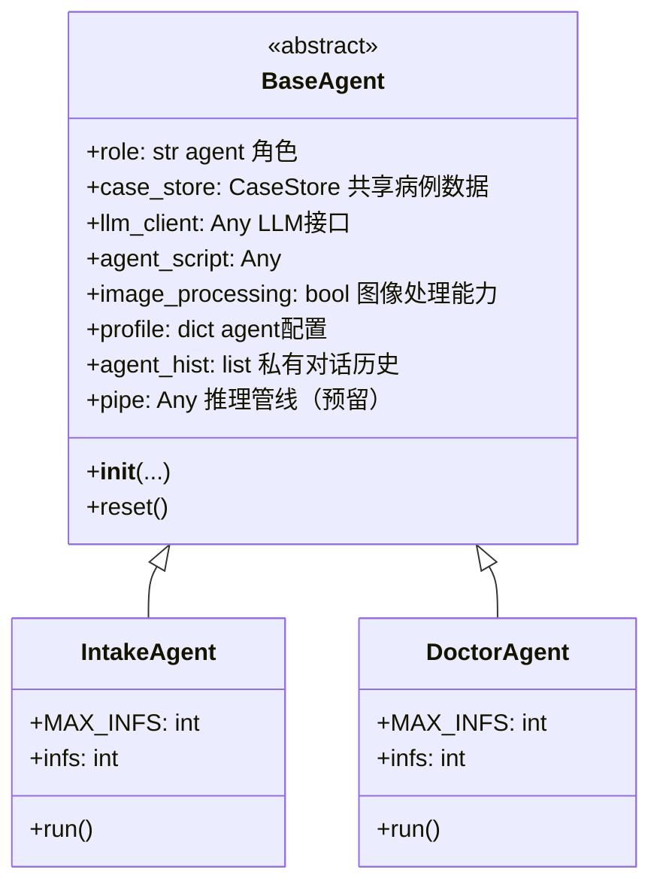

```mermaid
classDiagram

class BaseAgent {
    <<abstract>>

    +role: str               agent 角色
    +case_store: CaseStore 共享病例数据
    +llm_client: Any        LLM接口
    +agent_script: Any     
    +image_processing: bool 图像处理能力
    +profile: dict         agent配置
    
    +agent_hist: list      私有对话历史
    
    +pipe: Any             推理管线（预留）

    +__init__(...)
    +reset()
}

class IntakeAgent {
    +MAX_INFS: int
    +infs: int
    +run()
}

class DoctorAgent {
    +MAX_INFS: int
    +infs: int
    +run()
}

BaseAgent <|-- IntakeAgent
BaseAgent <|-- DoctorAgent
```