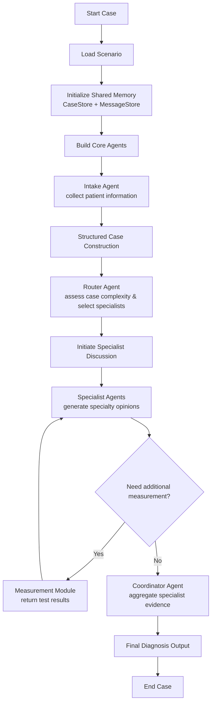

```mermaid
flowchart TD
    A[Start Case] --> B[Load Scenario]
    B --> C[Initialize Shared Memory<br/>CaseStore + MessageStore]
    C --> D[Build Core Agents]

    D --> E[Intake Agent<br/>collect patient information]
    E --> F[Structured Case Construction]
    F --> G[Router Agent<br/>assess case complexity & select specialists]

    G --> M[Initiate Specialist Discussion]
    M --> N[Specialist Agents<br/>generate specialty opinions]

    N --> O{Need additional measurement?}
    O -- Yes --> P[Measurement Module<br/>return test results]
    P --> N
    O -- No --> Q[Coordinator Agent<br/>aggregate specialist evidence]

    Q --> R[Final Diagnosis Output]
    R --> S[End Case]
```