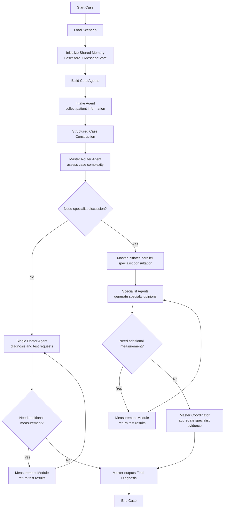

```mermaid
flowchart TD
    A[Start Case] --> B[Load Scenario]
    B --> C[Initialize Shared Memory<br/>CaseStore + MessageStore]
    C --> D[Build Core Agents]

    D --> E[Intake Agent<br/>collect patient information]
    E --> F[Structured Case Construction]
    F --> G[Master Router Agent<br/>assess case complexity]

    G --> H{Need specialist discussion?}

    H -- No --> I[Single Doctor Agent<br/>diagnosis and test requests]
    I --> J{Need additional measurement?}
    J -- Yes --> K[Measurement Module<br/>return test results]
    K --> I
    J -- No --> R[Master outputs Final Diagnosis]

    H -- Yes --> M[Master initiates parallel specialist consultation]
    M --> N[Specialist Agents<br/>generate specialty opinions]
    N --> O{Need additional measurement?}
    O -- Yes --> P[Measurement Module<br/>return test results]
    P --> N
    O -- No --> Q[Master Coordinator<br/>aggregate specialist evidence]
    Q --> R

    R --> S[End Case]
```